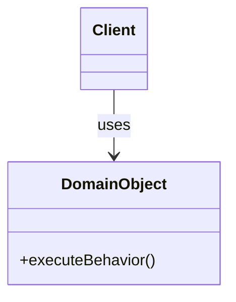

# Lesson: [Lesson Title]

## Motto
> **[One-line punchy motto that captures the core architectural or design insight]**

---

## Problem
[Describe the real-world domain problem or software requirement. Why does a naive or ad-hoc approach fail? What pain does the developer or system experience without this design concept?]

---

## Requirements
### Functional Requirements
- [FR-1] ...
- [FR-2] ...
- [FR-3] ...

### Non-Functional Requirements & Constraints
- [NFR-1] Extensibility: ...
- [NFR-2] Testability: ...
- [NFR-3] Invariants / Thread Safety / Performance: ...

---

## Assumptions
- What is explicitly assumed about the environment, scale, or callers?
- What is deliberately left out of scope?

---

## Prediction
[Before looking at any design or code, predict: Where will the complexity live? Which objects will tempt you to make them "God Objects"? How would a beginner solve this, and where will that naive approach break?]

---

## Why this matters
[Explain the impact on real systems: maintenance debt, bug explosion, shotgun surgery, un-testability, or inability to support new business models.]

---

## First principles
[Deconstruct the problem to core computer science and OOP fundamentals:
- Identity vs State vs Behavior
- Information Hiding and Encapsulation
- Separation of Concerns and Cohesion
- Contract vs Implementation]

---

## Use cases
Trace the primary user/caller journeys:
```text
Actor
  ↓ triggers
Use Case 1: [Name]
  ↓ step 1
  ↓ step 2
Result / Observable Side Effect
```

Alternate & Failure Paths:
- Path 1A: [What happens when inputs are invalid]
- Path 1B: [What happens when preconditions fail]

---

## Responsibilities
| Responsibility | Owner Candidate | Justification (Information Expert / High Cohesion) |
|:---|:---|:---|
| [e.g. Calculate pricing] | [e.g. PricingPolicy] | [Owns the tariff rules and duration calculations; keeps ParkingLot thin] |
| [e.g. Track spot occupancy] | [e.g. ParkingSpot] | [State is local to spot; guards spot status invariant] |

---

## Domain model
Textual and ASCII/Mermaid representation of the domain entities, value objects, and relationships:



---

## Initial design
[Describe the minimal, naive, or initial design. Explain the thought process of why this seems reasonable at first glance.]

---

## Implement it
```java
// Runnable, focused implementation of the core domain behavior
```

---

## Test it
```java
// Unit tests verifying behavior, invariants, and edge cases
@Test
void shouldSatisfyCoreBehavior() {
    // Arrange
    // Act
    // Assert
}
```

---

## New requirement
> ⚠️ **A new requirement arrives from product management:**
> [State the new requirement that applies pressure to the existing design.]

---

## Break the design
[Show exactly how the initial design resists change. Does it require modifying 10 switch cases? Does it violate open/closed? Does it force invalid states?]

---

## Refactor it
[Refactor step-by-step:
1. Identify the design smell (e.g. Feature Envy, Divergent Change, Primitive Obsession)
2. Introduce the appropriate abstraction or principle (e.g. Strategy, State, Value Object)
3. Show the refactored code and run tests to prove external behavior remained intact]

---

## Alternative design
[Compare at least one alternative design:
- Composition vs Inheritance
- State pattern vs Enum transition table
- In-memory collection vs Repository interface
Why was one chosen over the other?]

---

## Tradeoffs
| Design Choice | Pros | Cons / Overhead |
|:---|:---|:---|
| [Option A] | | |
| [Option B] | | |

---

## Evidence
Copy and fill in `outputs/evidence-template.md` documenting your test execution, git diff, and mental model validation.

---

## Questions for mastery
- [ ] **Conceptual:** [Question probing the "why" behind the design choice, not pattern trivia]
- [ ] **Failure Mode:** [What edge case breaks this if assumptions are violated?]
- [ ] **Refactoring:** [Under what specific change in requirement would this design need to be restructured?]

---

## What comes next
[Preview of the next lesson and how this concept lays the foundation for future lessons.]
