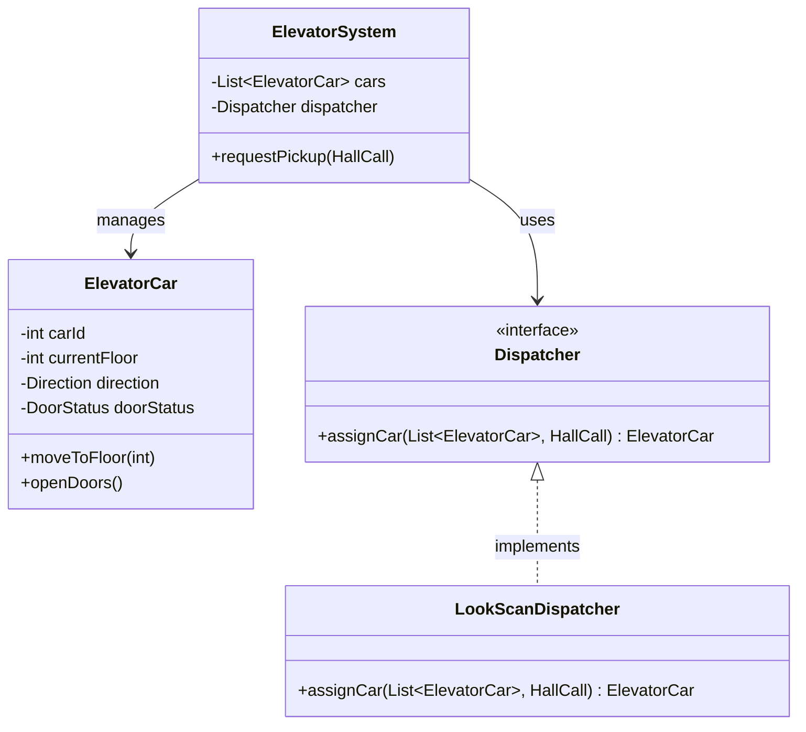

# Elevator System Class Architecture

```mermaid
classDiagram
    class ElevatorSystem {
        -List~ElevatorCar~ cars
        -Dispatcher dispatcher
        +requestPickup(HallCall)
    }
    class ElevatorCar {
        -int carId
        -int currentFloor
        -Direction direction
        -DoorStatus doorStatus
        +moveToFloor(int)
        +openDoors()
    }
    class Dispatcher {
        <<interface>>
        +assignCar(List~ElevatorCar~, HallCall) ElevatorCar
    }
    class LookScanDispatcher {
        +assignCar(List~ElevatorCar~, HallCall) ElevatorCar
    }
    ElevatorSystem --> ElevatorCar : manages
    ElevatorSystem --> Dispatcher : uses
    Dispatcher <|.. LookScanDispatcher : implements

```
