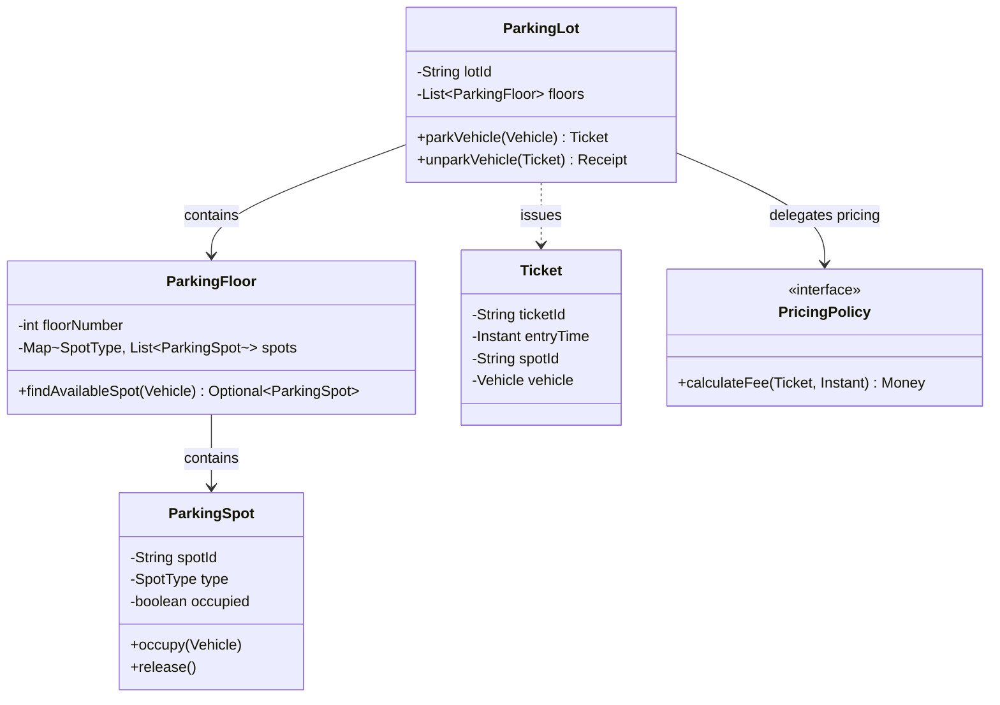

# Parking Lot Class Architecture

```mermaid
classDiagram
    class ParkingLot {
        -String lotId
        -List~ParkingFloor~ floors
        +parkVehicle(Vehicle) Ticket
        +unparkVehicle(Ticket) Receipt
    }
    class ParkingFloor {
        -int floorNumber
        -Map~SpotType, List~ParkingSpot~~ spots
        +findAvailableSpot(Vehicle) Optional~ParkingSpot~
    }
    class ParkingSpot {
        -String spotId
        -SpotType type
        -boolean occupied
        +occupy(Vehicle)
        +release()
    }
    class Ticket {
        -String ticketId
        -Instant entryTime
        -String spotId
        -Vehicle vehicle
    }
    class PricingPolicy {
        <<interface>>
        +calculateFee(Ticket, Instant) Money
    }
    ParkingLot --> ParkingFloor : contains
    ParkingFloor --> ParkingSpot : contains
    ParkingLot --> PricingPolicy : delegates pricing
    ParkingLot ..> Ticket : issues

```
