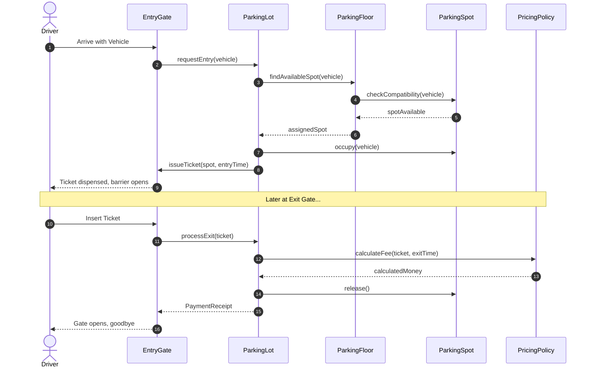

# Parking Lot Entry & Exit Sequence

```mermaid
sequenceDiagram
    autonumber
    actor Driver
    participant Gate as EntryGate
    participant PL as ParkingLot
    participant Floor as ParkingFloor
    participant Spot as ParkingSpot
    participant Tariff as PricingPolicy

    Driver->>Gate: Arrive with Vehicle
    Gate->>PL: requestEntry(vehicle)
    PL->>Floor: findAvailableSpot(vehicle)
    Floor->>Spot: checkCompatibility(vehicle)
    Spot-->>Floor: spotAvailable
    Floor-->>PL: assignedSpot
    PL->>Spot: occupy(vehicle)
    PL->>Gate: issueTicket(spot, entryTime)
    Gate-->>Driver: Ticket dispensed, barrier opens

    Note over Driver, Tariff: Later at Exit Gate...

    Driver->>Gate: Insert Ticket
    Gate->>PL: processExit(ticket)
    PL->>Tariff: calculateFee(ticket, exitTime)
    Tariff-->>PL: calculatedMoney
    PL->>Spot: release()
    PL-->>Gate: PaymentReceipt
    Gate-->>Driver: Gate opens, goodbye

```
