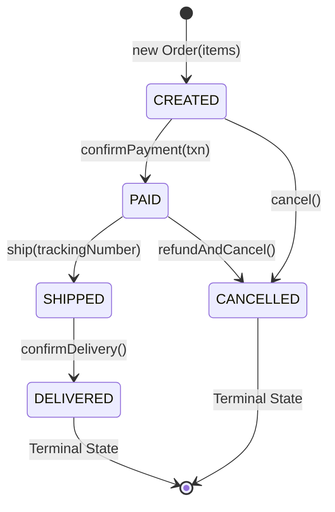

# Order Domain Lifecycle Invariants

```mermaid
stateDiagram-v2
    [*] --> CREATED : new Order(items)
    CREATED --> PAID : confirmPayment(txn)
    CREATED --> CANCELLED : cancel()
    PAID --> SHIPPED : ship(trackingNumber)
    PAID --> CANCELLED : refundAndCancel()
    SHIPPED --> DELIVERED : confirmDelivery()
    DELIVERED --> [*] : Terminal State
    CANCELLED --> [*] : Terminal State

```
