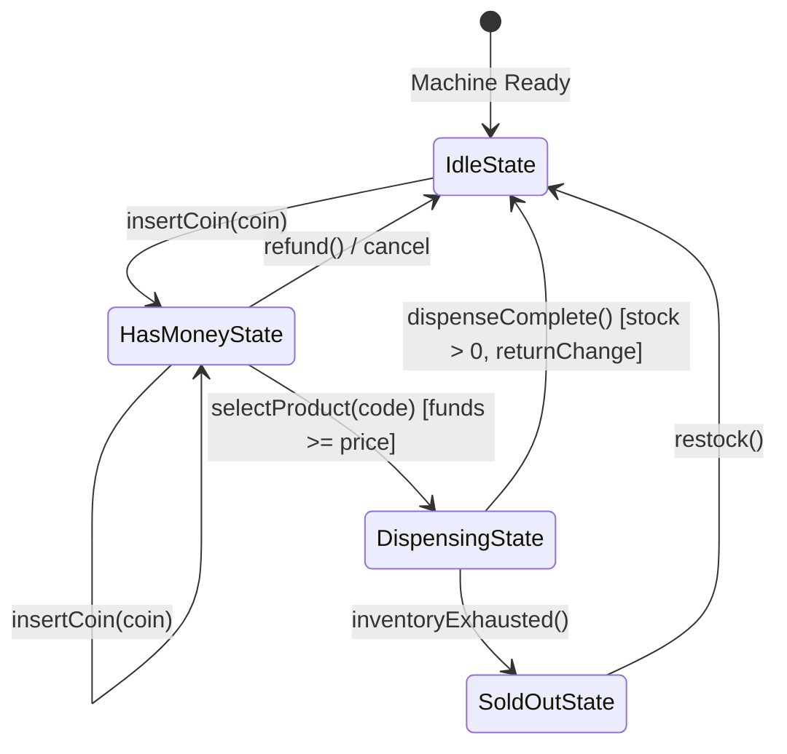

# Vending Machine State Lifecycle

```mermaid
stateDiagram-v2
    [*] --> IdleState : Machine Ready
    IdleState --> HasMoneyState : insertCoin(coin)
    HasMoneyState --> HasMoneyState : insertCoin(coin)
    HasMoneyState --> IdleState : refund() / cancel
    HasMoneyState --> DispensingState : selectProduct(code) [funds >= price]
    DispensingState --> IdleState : dispenseComplete() [stock > 0, returnChange]
    DispensingState --> SoldOutState : inventoryExhausted()
    SoldOutState --> IdleState : restock()

```
