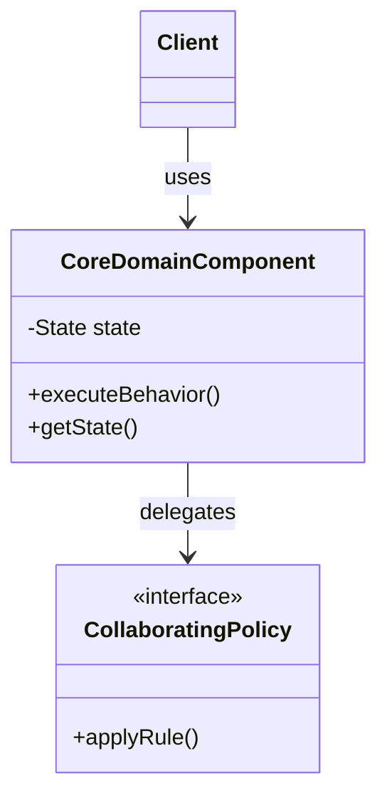

# Lesson 125: Concurrency Challenge: Eliminating Double-Booking Races

## Motto
> **"Detect and eliminate a critical double-booking race condition under multi-threaded load."**

---

## Problem
Un-synchronized inventory checks allow two threads to book the same seat simultaneously.

---

## Requirements
### Functional Requirements
- **FR-1:** Model core behavioral contracts and entities for Concurrency Challenge: Eliminating Double-Booking Races.
- **FR-2:** Enforce domain rules, transition invariants, and input boundary validations.
- **FR-3:** Expose clean, hard-to-misuse public interfaces.

### Non-Functional Requirements & Invariants
- **NFR-1 (Invariants):** State must remain strictly valid across all operations; invalid transitions must fail fast.
- **NFR-2 (Testability):** 100% of domain behavior must be verifiable via automated unit tests without external databases or network services.
- **NFR-3 (Extensibility):** Design must accommodate future requirement changes with minimal modification to stable contracts.

---

## Assumptions
- Target execution environment: Java 21+ LTS and JUnit 5.
- Single process execution context with explicit dependency boundaries.
- External infrastructure systems (databases, HTTP APIs, third-party SDKs) are abstracted behind interfaces.

---

## Prediction
Before looking at code:
- Where is the primary complexity in this problem?
- What would a naive, monolithic implementation look like?
- Which class will tempt you to make it a "God Object"?

---

## Why this matters
Un-synchronized inventory checks allow two threads to book the same seat simultaneously. When systems lack clear responsibilities and invariant guards, technical debt compounds rapidly until every small feature request introduces regressions.

---

## First principles
1. **Behavior Precedes Structure:** We derive classes from dynamic use case responsibilities, not from static noun parsing.
2. **Invariant Fortress:** Every object is responsible for protecting its own internal state; external callers cannot force an object into an illegal state.
3. **Explicit Contracts:** Collaborators interact exclusively through narrow, domain-owned interfaces.

---

## Use cases
```text
Actor / Caller
  ↓ triggers
Use Case: Primary Execution Workflow
  ↓ Step 1: Precondition check & invariant validation
  ↓ Step 2: Responsibility delegation to domain experts
  ↓ Step 3: State transition & event recording
Result / Observable Outcome
```

---

## Responsibilities (GRASP Information Expert)
| Responsibility | Owner Candidate | Architectural Justification |
|:---|:---|:---|
| Guard domain state integrity | Domain Entity | Holds the internal fields; Information Expert. |
| Execute varying business calculation | Policy / Strategy | Isolates algorithmic variation from the entity. |
| Coordinate use case orchestration | Application Service | Directs workflow across entities and ports without owning domain logic. |

---

## Domain model


---

## Initial design
Initial implementation uses the simplest cohesive structure:
- Classes: `ConcurrentSeatBookingGuard`
- Verification: `DoubleBookingRaceTest`

---

## Implement it
```java
// See companion implementation under src/main/java/lld/...
```

---

## Test it
Run the automated test suite:
```bash
mvn test -Dtest=DoubleBookingRaceTest
```

---

## New requirement (Design Pressure)
> ⚠️ **A new business requirement arrives:**  
> The system must now support dynamic variations, alternative policies, or unexpected runtime conditions without breaking existing caller contracts.

---

## Break the design
The naive initial design resists this change:
- Adding the requirement requires modifying multiple switch branches or if-else statements across existing files.
- Modifying existing classes risks introducing regressions into already verified behaviors.

---

## Refactor it
1. Identify the design smell: Divergent Change / Feature Envy.
2. Introduce the appropriate abstraction or principle: Open/Closed Principle via polymorphic Strategy or Value Object.
3. Decouple dependencies using explicit Constructor Injection.
4. Verify all tests continue to pass.

---

## Alternative design
- Compare a centralized coordinator approach vs a decentralized polymorphic model.
- Evaluate tradeoffs between static compilation safety and runtime configuration flexibility.

---

## Tradeoffs
| Design Choice | Pros | Cons / Overhead |
|:---|:---|:---|
| Simple Concrete Model | Minimal classes, easy to read for 1 variant | Resists change when new requirements arrive |
| Polished Abstraction / Seam | Open for extension, isolated testability | Adds indirection and extra interfaces |

---

## Evidence
Copy and fill in `outputs/evidence-template.md` documenting your test execution and architectural reflection.

---

## Questions for mastery
- [ ] **Mastery Question:** Why does Concurrency Challenge: Eliminating Double-Booking Races matter when system requirements evolve over 6+ months?
- [ ] **Mastery Question:** How would a junior engineer incorrectly solve this problem, and what failure scenario exposes their mistake?
- [ ] **Mastery Question:** What is the simplest sufficient design for Concurrency Challenge: Eliminating Double-Booking Races before introducing complex patterns?

---

## What comes next
Phase 126: Persistence Challenge
