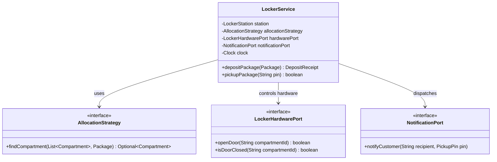

# Phase 146: The Final Mental Model — Autonomous First-Principles Mastery

> **Motto:**  
> **"Understand it. Model it. Build it. Break it. Refactor it. Test it. Extend it. Ship it."**

---

## The Culmination of Low-Level Design Mastery

You have journeyed through 146 phases. You have dismantled God objects, designed invariant fortresses, decoupled tight networks using interfaces and events, felt the pain of change before introducing patterns, and tamed concurrent races.

Now, you are presented with an ambiguous, unseen prompt from a technical interviewer or product leader:

> **"Design an Automated Package Locker System."**

Notice your reaction. You do **not** pause to search your memory for a Gang of Four pattern. You do **not** wonder whether the interviewer prefers Factory, Strategy, or State.

Instead, your mind automatically and systematically begins the **13-stage First-Principles LLD Reasoning Loop**.

---

## Stage 1: Who Are the Actors?
- **Delivery Courier:** Drops off packages into appropriately sized compartments; receives compartment assignments; inputs customer tracking tokens.
- **Customer (Recipient):** Inputs a secure one-time pickup PIN / barcode; retrieves package from popped open door; closes door.
- **Locker Hardware Controller:** Operates physical solenoid door latches; reads door open/close magnetic contact sensors.
- **Customer Support Agent / Admin:** Overrides jammed doors; retrieves abandoned packages; audits history.

---

## Stage 2: What Are the Use Cases?
```text
Courier
  ↓
1. Scan Package Barcode (Dimensions & Recipient)
  ↓
2. Query Available Compatible Compartment (Small, Medium, Large)
  ↓
3. Reserve & Pop Door Open
  ↓
4. Deposit Package & Close Door
  ↓
5. System Generates Customer Pickup PIN & Dispatches Notification

Customer
  ↓
6. Approach Locker & Enter Pickup PIN
  ↓
7. System Validates PIN & Identifies Compartment
  ↓
8. Pop Door Open
  ↓
9. Customer Retrieves Package & Closes Door
  ↓
10. Compartment Marked AVAILABLE; PIN Invalidated
```

Alternate & Failure Paths:
- **PIN Expired (48h Timeout):** Customer enters expired PIN; system rejects and routes customer to support.
- **Locker Full:** No matching compartment size available; courier alerted before opening locker.
- **Customer Enters Wrong PIN 3 Times:** Temporary security lockout for 10 minutes.

---

## Stage 3: What Rules & Invariants Must Always Hold?
1. **Single Occupancy Invariant:** A compartment can hold at most one package at any time.
2. **Size Compatibility Invariant:** A package dimension must strictly fit within compartment dimensions (Small, Medium, Large).
3. **PIN Secrecy & Expiration Invariant:** A customer PIN is generated securely, single-use, and valid for exactly 48 hours.
4. **Hardware Sensor Invariant:** A compartment cannot transition to AVAILABLE until the physical sensor confirms the door is securely closed.

---

## Stage 4: What Domain Concepts Exist?
- **Entities (Identity):**
  - `LockerStation`: Identified by station ID (`LOC-NYC-042`).
  - `Compartment`: Identified by compartment ID (`C-101`), holds state and physical size.
  - `Package`: Identified by tracking number (`PKG-98765`).
  - `LockerDeposit`: Tracks the active lifecycle of a package inside a compartment.
- **Value Objects (Structural Equality & Immutability):**
  - `Dimensions(length, width, height, unit)`
  - `PickupPin(code, expiresAt)`
  - `TimeWindow(start, end)`

---

## Stage 5: Who Owns Each Responsibility? (GRASP Information Expert)
| Responsibility | Owner | Justification |
|:---|:---|:---|
| Determine if package fits in compartment | `Compartment` | Information Expert holding compartment internal dimensions. |
| Generate secure pickup PIN with 48h expiry | `PinGenerator` | Isolates crypto/randomness and time dependencies. |
| Manage compartment allocation policy | `AllocationStrategy` | Open/Closed: enables Best-Fit, Energy-Saving, or Lower-Tier Allocation. |
| Coordinate deposit workflow & dispatch alerts | `LockerService` | Application Service orchestrator. |
| Interface with physical latch and door sensor | `LockerHardwareDriver` | Hexagonal Port isolating physical embedded hardware from domain logic. |

---

## Stage 6: Where Are the Boundaries & Interfaces?


---

## Stage 7: What Can Vary? (Where Does Extension Live?)
- **Allocation Strategy:** Today it allocates the smallest fitting compartment (Best Fit). Tomorrow it allocates lower compartments for disabled users (ADA Accessible Allocation).
- **Notification Channel:** SMS, Email, or Mobile App Push.
- **Time Validation:** Injecting `java.time.Clock` ensures deterministic testing of 48-hour expirations.

---

## Stage 8: How Do We Test It?
1. **Happy Path:** Deposit package -> door pops -> close door -> enter valid PIN -> door pops -> retrieve package -> compartment marked available.
2. **Size Defense:** Depositing Large package when only Small compartments are free throws `NoAvailableCompartmentException`.
3. **Temporal Invariant:** Fast-forward injected `Clock` by 49 hours; entering PIN throws `PinExpiredException`.
4. **Concurrency Race:** Two couriers simultaneously requesting the last Medium compartment; one succeeds, one fails gracefully.

---

## Stage 9: The Verified Implementation
Inspect the runnable, test-covered implementation:
- Core Model: `src/main/java/lld/capstones/locker/PackageLockerSystem.java`
- Unit Test Suite: `src/test/java/lld/capstones/locker/PackageLockerSystemTest.java`

Run the test suite:
```bash
mvn test -Dtest=PackageLockerSystemTest
```

Expected output:
```text
[INFO] Running lld.capstones.locker.PackageLockerSystemTest
[INFO] Tests run: 1, Failures: 0, Errors: 0, Skipped: 0, Time elapsed: 0.003 s
[INFO] BUILD SUCCESS
```

---

## The Definition of LLD Mastery

> Low-Level Design is no longer a collection of class diagrams and pattern names.
>
> We learned to begin with requirements, identify behavior and invariants, assign responsibilities, design explicit contracts, introduce abstractions only when change demanded them, and continuously test and refactor our designs as requirements evolved.
>
> Now when we are asked to design a system, we can move deliberately from behavior to responsibilities to collaborating objects—and explain not only what we built, but why the design is structured that way.
