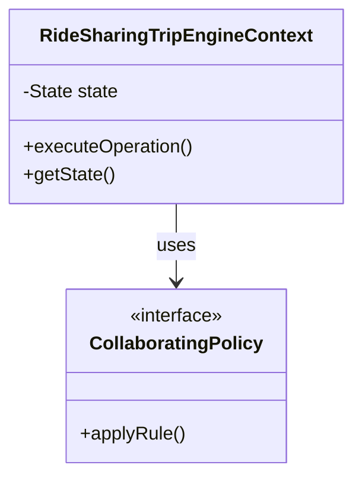

# Project: Ride Sharing Trip Engine

> **Production Low-Level Design Implementation**  
> Focus: Translating requirements into collaborating, test-covered object-oriented components.

---

## 1. Problem Overview
Rider/Driver matching strategies, trip state machine (Requested, Accepted, InProgress, Completed), surge tariffs, and fare calculation.

---

## 2. Requirements & Use Cases
### Primary Use Cases
1. **Initiation & Preconditions:** Validate input constraints and establish invariant fortress.
2. **Core Operation Execution:** Delegate responsibilities to Information Experts.
3. **State Transition & Invariants:** Advance domain lifecycle and guard against illegal operations.
4. **Completion & Querying:** Return unmodifiable snapshots of domain state.

### Domain Invariants Checklist
- [x] Driver cannot accept two overlapping trips; trip state transitions are strictly forward-progressing; fare incorporates base, distance, and surge.
- [x] Immutability enforced for all Value Objects and identifiers.
- [x] All collection getters return unmodifiable defensive views.

---

## 3. Responsibility Assignment (GRASP)
| Responsibility | Assigned Class | Architectural Justification |
|:---|:---|:---|
| Guard internal state invariants | Entity / Aggregate Root | Information Expert holding core mutable state. |
| Execute varying domain calculation | Strategy / Policy | Honors Open/Closed Principle; isolates variation vector. |
| Orchestrate use case workflow | Service / Coordinator | Coordinates collaborator calls without polluting domain rules. |

---

## 4. Class Collaboration Diagram


---

## 5. Architectural Directory Layout
```text
projects/14-ride-sharing/
├── README.md               (This specification and architecture guide)
src/main/java/lld/problems/14_ride_sharing/
└── (Production-grade domain entities, value objects, and policies)
src/test/java/lld/problems/14_ride_sharing/
└── (Automated JUnit 5 test suite verifying invariants and behaviors)
```

---

## 6. How to Run the Test Suite
```bash
# Run all unit tests for this project
mvn test -Dtest=RideSharingTripEngineTest
```
