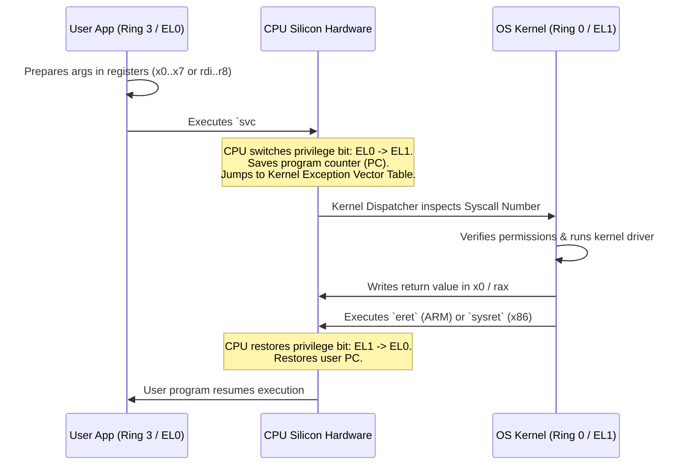

# 01: What is an Operating System? (The First-Principles Deconstruction)

> **"An operating system is an illusionist and an arbitrator."**

---

## 1. The Bare-Metal Reality: Life Without an OS

Imagine a computer with **no operating system** (like a raw microcontroller or early 1970s mainframe):

```
┌────────────────────────────────────────────────────────┐
│                   YOUR PROGRAM                         │
│  (Direct access to Physical RAM, Disk, CPU Registers)   │
└───────────────────────────┬────────────────────────────┘
                            │ Raw Memory Addresses (0x0000 to 0xFFFF)
┌───────────────────────────▼────────────────────────────┐
│                    PHYSICAL HARDWARE                   │
│         CPU, RAM Chips, Disk Platters, NIC             │
└────────────────────────────────────────────────────────┘
```

If you run software on bare metal:
1. **No Concurrency**: Only one program runs at a time. If it enters an infinite loop `while(1);`, the physical computer is frozen forever until power-cycled.
2. **No Memory Safety**: Your program accesses raw physical memory addresses (`0x0010_0000`). If Program B starts, whose data is at `0x0010_0000`? They overwrite each other. A single rogue pointer corrupts the entire machine.
3. **No Hardware Abstraction**: To save a byte to disk, you must talk directly to the disk controller via Memory-Mapped I/O (MMIO), compute cylinder/head/sector geometry, wait for the platter to spin, and handle drive motor timeouts manually.

---

## 2. What an Operating System Actually Is

An Operating System (OS) is not just "a piece of software." It is a **kernel running in privileged hardware mode** that does two fundamental things:

### A. The Three Great Illusions (Virtualization)
The OS creates three software illusions so programmers don't lose their sanity:

| Physical Reality | The OS Illusion | The Abstraction |
|---|---|---|
| 8 CPU cores shared by 500 apps | Every program feels like it has a dedicated CPU running uninterrupted | **The Process & Scheduler** |
| A shared, fragmented stick of physical RAM | Every program thinks it has a private, clean address space from `0x0` to `0x7fff...` | **Virtual Memory & Page Tables** |
| Raw magnetic platters / NAND flash blocks & Ethernet electrical pulses | Everything is a clean, byte-stream named entity you can `open()`, `read()`, `write()` | **The File System & Sockets (File Descriptors)** |

### B. The Arbitrator (Protection & Resource Management)
When 50 programs run concurrently, they all compete for the CPU, RAM, disk, and network. The OS acts as the supreme court:
* It decides who gets CPU time (Preemptive Scheduling).
* It ensures Process A cannot read or write Process B's memory (Address Isolation).
* It prevents any single program from hogging 100% of memory or network bandwidth (Limits & Quotas).

---

## 3. How the Hardware Enforces It: CPU Privilege Rings

How does the OS stop a user program from simply turning off the scheduler or peeking into another app's memory?

**The CPU itself enforces it at the silicon level.**

Modern CPUs (ARM64 and x86_64) implement **Hardware Privilege Levels**:

```
           ┌──────────────────────────────────────────────┐
           │   User Space (Ring 3 / ARM EL0)              │
           │   - Python, Java, Web Browsers, Databases    │
           │   - CANNOT execute privileged instructions   │
           └──────────────────────┬───────────────────────┘
                                  │ System Call (`svc #0` / `syscall`)
                                  │ OR Hardware Interrupt / Exception
           ┌──────────────────────▼───────────────────────┐
           │   Kernel Space (Ring 0 / ARM EL1)            │
           │   - OS Kernel: Linux, macOS XNU, Windows NT  │
           │   - Has full, unrestricted hardware access   │
           └──────────────────────────────────────────────┘
```

### The Forbidden Instructions
When the CPU is in **User Mode (Ring 3 / EL0)**, the silicon circuits physically reject certain CPU instructions:
* Modifying the Page Table Base Register (`CR3` in x86_64, `TTBR0_EL1` in ARM64) -> **Forbidden**.
* Disabling hardware interrupts (`cli`) -> **Forbidden**.
* Directly executing I/O port instructions (`in`, `out`) -> **Forbidden**.

If a user program tries to execute any of these, the CPU triggers a **Hardware Fault (Trap)**, halts the user program, and forcibly switches to the kernel's fault handler.

---

## 4. The Gateway: How User Code Crosses into the Kernel

Since user programs are locked in a sandbox, how do they print to the screen, read a file, or open a network connection?

Through the **System Call (Syscall)**:



---

## 5. Live Demonstration: Proving the Hardware Enforces the Boundary

What happens when user code attempts to read an unmapped physical address or write to protected memory?
The MMU (Memory Management Unit) rejects the memory cycle and signals a **Page Fault** to the CPU, which notifies the kernel, generating a `SIGSEGV` (Segmentation Fault).

### Concrete C Code: Catching the Memory Trap
```c
#include <stdio.h>
#include <signal.h>
#include <stdlib.h>

void segfault_handler(int sig) {
    printf("[KERNEL SIGNAL] Caught signal %d (SIGSEGV)!\n", sig);
    printf("The CPU MMU caught our attempt to touch protected memory.\n");
    printf("The OS prevented a catastrophic machine crash.\n");
    exit(0);
}

int main(void) {
    signal(SIGSEGV, segfault_handler);

    printf("Attempting to dereference NULL pointer (0x0)...\n");
    int *bad_ptr = NULL;
    
    // The CPU MMU checks the Page Table.
    // Address 0x0 is marked NOT PRESENT / NO PERMISSION.
    // The CPU generates a Page Fault Exception -> Kernel -> SIGSEGV!
    *bad_ptr = 42; 

    return 0;
}
```

---

## 6. Summary: The Super Engineer Mental Model

1. **A program is passive text** (machine code instructions sitting dead on an SSD).
2. **A process is an active organism** (allocated virtual memory, open file descriptor tables, register state, stack, and heap).
3. **The OS is the referee and puppet-master**:
   - It maintains **Process Control Blocks (PCB)** and **Page Tables**.
   - It coordinates hardware timer interrupts (typically firing 100 to 1000 times per second) to yank control away from running processes and switch between them (preemption).
4. **Everything you do in backend/distributed engineering is constrained by this layer**:
   - High latency? You are doing too many syscalls or page faults.
   - High memory? Your process virtual pages haven't been released to the OS page pool.
   - App crash? The CPU trapped an illegal instruction, address violation, or integer divide-by-zero.
