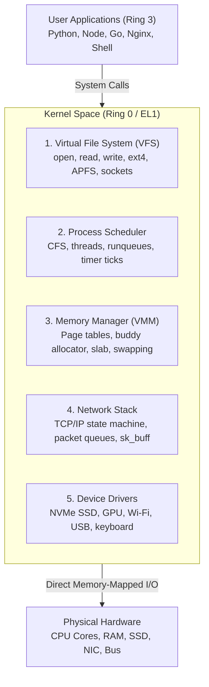

# 03: What is the Kernel Actually?

> **"The kernel is not an ethereal concept. It is a single, compiled binary program that boots into physical RAM, runs in CPU Ring 0, and never exits."**

---

## 1. Ground Truth: What is the Kernel on Disk?

If you inspect an operating system on an SSD, the kernel is literally just a **binary executable file**:
* On Linux: `/boot/vmlinuz-linux` (compressed ELF binary, ~10–30 MB)
* On macOS: `/System/Library/Kernels/kernel` (Mach-O 64-bit binary)
* On Windows: `C:\Windows\System32\ntoskrnl.exe` (PE executable)

Like any C program, the kernel was compiled using a standard compiler (`gcc` or `clang`) from millions of lines of C and assembly code.

---

## 2. How the Kernel Boots and Seizes Control

How does this file transition into running the entire computer?

```
┌─────────────────┐     ┌──────────────────┐     ┌──────────────────────┐     ┌────────────────────────┐
│  Power On (ROM) │ ──> │ Bootloader (EFI) │ ──> │ Kernel Loaded to RAM │ ──> │ PID 1 Launched (Init)  │
│ Hardware checks │     │ Finds kernel on  │     │ Jumps to start_kernel│     │ Systemd / launchd      │
│ & resets CPU    │     │ disk & loads it  │     │ Runs in Ring 0 / EL1 │     │ Spawns user ecosystem  │
└─────────────────┘     └──────────────────┘     └──────────────────────┘     └────────────────────────┘
```

1. **Power On**: The motherboard firmware (UEFI / iBoot) runs hardware diagnostics (POST).
2. **Bootloader Hand-off**: The firmware hands execution to a bootloader (GRUB, systemd-boot, or Apple iBoot).
3. **Copy to RAM**: The bootloader copies the kernel binary from SSD into physical memory.
4. **The Jump to Ring 0**: The bootloader switches the CPU into its highest hardware privilege level (**Ring 0** on x86, **EL1** on ARM64), sets up the initial Page Table and Stack, and jumps the CPU Program Counter (`PC`) to the kernel’s entry function (e.g. `start_kernel()` in Linux).
5. **The Kernel Never Exits**: Normal apps execute `main()` and call `exit()`. **The kernel never returns.** When it finishes initializing hardware, it launches **PID 1** (`launchd` on macOS, `systemd` on Linux) into unprivileged User Space (Ring 3 / EL0), and spends the rest of its existence responding to interrupts and system calls.

---

## 3. Where Does the Kernel Live in Memory?

When an application runs, it doesn't get 100% of the virtual address space to itself. The OS splits every process's virtual memory map:

```
┌────────────────────────────────────────────────────────┐ 0xFFFF_FFFF_FFFF_FFFF (Top of Memory)
│                  KERNEL SPACE                          │
│  - Kernel code, page tables, PCB tables, buffers       │
│  - Mapped into EVERY process address space             │
│  - Protected by CPU hardware bit (Ring 0 / EL1 only)   │
├────────────────────────────────────────────────────────┤ 0xFFFF_8000_0000_0000 (Higher-half split)
│                     CANONICAL HOLE                     │
│                  (Unused 64-bit space)                 │
├────────────────────────────────────────────────────────┤ 0x0000_7FFF_FFFF_FFFF
│                  USER SPACE                            │
│  - Stack (grows down)                                  │
│  - Heap / malloc (grows up)                            │
│  - Loaded libraries & program machine code             │
└────────────────────────────────────────────────────────┘ 0x0000_0000_0000_0000
```

> [!NOTE]
> Even though kernel memory is mapped into the virtual address space of every user application, the CPU's MMU **refuses memory reads/writes** to that upper region unless the CPU is currently executing in Ring 0 / EL1. If user code tries to read a kernel address, the CPU triggers a Page Fault immediately!

---

## 4. The 5 Core Subsystems of the Kernel

What is actually inside those millions of lines of kernel code?



1. **Process Scheduler**: Tracks every thread in a `struct task_struct` (Process Control Block). Every few milliseconds, a physical hardware timer interrupt fires, pausing the current thread, calculating CPU virtual runtime, and picking the next thread to run (Preemption).
2. **Virtual Memory Manager (VMM)**: Manages physical page frames (typically 4 KB or 16 KB chunks). Handles page faults, allocates memory with the Buddy Allocator, and manages the kernel `slab` / `kmalloc` caches.
3. **Virtual File System (VFS)**: An abstraction layer that translates universal calls like `read(fd, buf, len)` into filesystem-specific drivers (whether APFS, ext4, ZFS, or NFS).
4. **Network Stack**: Implements Layer 2 through Layer 4. Parses raw Ethernet frames into IP packets, maintains the TCP sliding window and state machines, and exposes standard BSD socket endpoints.
5. **Device Drivers**: The low-level C code that writes specific bit sequences to hardware registers to make disk heads read blocks or network cards send radio pulses.

---

## 5. Kernel Architectures: Monolithic vs Microkernel vs Hybrid

| Architecture | How It Works | Strengths | Weaknesses | Examples |
|---|---|---|---|---|
| **Monolithic** | Everything (drivers, network, filesystem, scheduler) runs inside Ring 0 in one giant address space. | Maximum speed (all internal communication is fast direct C function calls). | Low fault tolerance: a single null pointer in a Wi-Fi driver panics the entire machine. | **Linux**, FreeBSD |
| **Microkernel** | Only bare minimum (IPC, basic paging, thread scheduling) runs in Ring 0. Drivers and filesystems run in User Mode (Ring 3). | Extreme stability & security: if the audio driver crashes, it restarts like any app without freezing the OS. | Slower: communicating between filesystem and disk requires expensive IPC context switches. | **seL4**, QNX, Minix |
| **Hybrid** | Combines a microkernel core with monolithic performance modules in Ring 0. | Fast performance with clean message-passing abstractions. | Complexity: large code footprint in Ring 0. | **macOS XNU** (Mach + BSD), Windows NT |

---

## 6. What Does the Kernel Do When Idle?

If you close all apps and your CPU usage is 0%, what is the kernel doing?

It runs the **Idle Thread (PID 0)**:
* It executes the CPU power-saving instruction:
  * On x86_64: `hlt` (Halt CPU clock until next hardware interrupt)
  * On ARM64: `wfi` (Wait For Interrupt)
* The CPU drops into a low-power sleep state ($C$-state). The moment an interrupt arrives (mouse move, packet arrival, or timer tick), the CPU wakes up in less than a microsecond and jumps back into the kernel dispatcher.

---

## 7. Interrogating the Living Kernel in C

We wrote and executed [`code/03_kernel_mach_query.c`](file:///Users/tushar/desktop/private/repos/operating-systems-from-scratch/phases/01-what-is-an-operating-system/notes/code/03_kernel_mach_query.c) to query your live kernel:

```bash
[Kernel Identity]
  Kernel Version String : Darwin Kernel Version 25.6.0: Fri Jul 31 19:11:03 PDT 2026; root:xnu-12377.161.14~5/RELEASE_ARM64_T8132
  Physical RAM Managed  : 16.00 GB
  Active CPU Cores      : 10 cores

[Kernel PCB / Task Accounting for PID 98132]
  Virtual Address Space : 435298880 KB
  Resident Memory (RAM) : 1312 KB
  Kernel CPU Time Used  : 0.000000 sec (CPU time spent inside Ring 0!)
```

This output directly reads the live `task_struct` and hardware descriptors maintained inside Ring 0 by the XNU kernel on your Mac.
