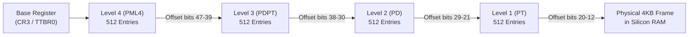

# 04: Virtual Memory & Page Tables (From Ground Truth to Silicon)

> **"Virtual memory is the grand illusion that every program owns all of RAM, while a hardware chip (the MMU) dynamically maps virtual illusions to fragmented physical reality."**

---

## 1. The Core Problem: Why We Can't Use Physical Memory Directly

Imagine physical RAM as a giant linear array of bytes from `0x0000_0000` to `0x3_FFFF_FFFF` (16 GB):

```
Physical RAM: [ Program A ][ Program B ][ Program C ][ Free Hole ][ Program A ] ...
```

If programs used raw physical addresses:
1. **Security & Corruption**: Program A could read or overwrite Program B's memory. Any rogue pointer could corrupt the kernel or steal cryptographic keys.
2. **External Fragmentation**: When programs start and stop, memory becomes like Swiss cheese—scattered with small free holes. If you need 100 MB of contiguous RAM, you will fail even if 2 GB of total free RAM is scattered across fragmented gaps!
3. **Relocation & Compilation Nightmare**: The compiler would need to know ahead of time *where* in physical RAM the program will be loaded.

---

## 2. The Solution: Virtual Memory

Virtual memory gives **every single process its own private, contiguous sandbox** from `0x0000_0000_0000_0000` to `0x7FFF_FFFF_FFFF`:

```
Process A Virtual View:            Process B Virtual View:
┌───────────────────────────┐      ┌───────────────────────────┐
│ Address: 0x1000 (Val: 10) │      │ Address: 0x1000 (Val: 99) │
└─────────────┬─────────────┘      └─────────────┬─────────────┘
              │                                  │
              │ (Page Table A)                   │ (Page Table B)
              ▼                                  ▼
      ┌──────────────────────────────────────────────────┐
      │               PHYSICAL RAM FRAMES                │
      │  [ Frame #42: Val 10 ] ... [ Frame #91: Val 99 ] │
      └──────────────────────────────────────────────────┘
```

Both processes can access virtual address `0x1000` at the exact same time without colliding, because their **Page Tables** map `0x1000` to completely different physical hardware frames.

---

## 3. Pages vs Frames

Memory is split into fixed-size blocks:
* **Virtual Page**: A chunk of virtual address space.
* **Physical Frame**: A chunk of physical silicon RAM chips.
* **Page Sizes**:
  * Standard x86_64: **4 KB** ($4096 \text{ bytes} = 2^{12}$).
  * Apple Silicon ARM64: **16 KB** ($16384 \text{ bytes} = 2^{14}$) or 4 KB.
  * Huge/Large Pages: **2 MB** or **1 GB** (used by high-performance databases to avoid TLB misses).

### Virtual Address Anatomy (e.g. 48-bit Virtual Address with 4 KB Pages)
A 48-bit virtual address is split into two components:
```
47                           12 11                      0
┌──────────────────────────────┬────────────────────────┐
│     Virtual Page Number      │      Page Offset       │
│           (36 bits)          │       (12 bits)        │
└──────────────────────────────┴────────────────────────┘
```
1. **The Offset (Lower 12 bits)**: Pinpoints the exact byte within a 4 KB page ($2^{12} = 4096$). The offset passes through directly to physical RAM unchanged!
2. **The Virtual Page Number (Upper 36 bits)**: Used as the index to look up which physical frame holds this page.

---

## 4. What is a Page Table?

A **Page Table** is an in-memory database managed by the kernel that stores translation rules.

Each entry is a **Page Table Entry (PTE)** (typically 64 bits / 8 bytes):

```
63  62           52 51                                12 11 10  9  8  7  6  5  4  3  2  1  0
┌──┬───────────────┬────────────────────────────────────┬──┬──┬──┬──┬──┬──┬──┬──┬──┬──┬──┬──┐
│NX│ Available...  │    Physical Frame Address (PFN)    │..│..│..│G │PS│D │A │PCD│PWT│U │W │P │
└──┴───────────────┴────────────────────────────────────┴──┴──┴──┴──┴──┴──┴──┴──┴──┴──┴──┴──┘
```

### Critical Hardware Flags in Every PTE:
* **P (Present)**: `1` if this page is currently resident in physical RAM; `0` if it's swapped to SSD or unallocated.
* **W (Writable / Read-Only)**: `1` if write access is permitted; `0` for read-only (e.g., code text segment).
* **U (User / Supervisor)**: `1` if user code (Ring 3) can access it; `0` if restricted to Kernel (Ring 0).
* **NX / XN (No-Execute)**: `1` if executing machine code from this page is forbidden (prevents buffer overflow exploits!).
* **D (Dirty)**: Hardware sets this to `1` the moment the CPU writes to the page (kernel flushes dirty pages to disk).
* **A (Accessed)**: Hardware sets this to `1` when the page is read (used by LRU page eviction algorithms).

---

## 5. The Scale Problem & Multi-Level Page Tables

Why can't we use a simple flat array for the page table?

* With a 48-bit address space and 4 KB pages, there are $2^{36} \approx 68.7 \text{ billion}$ pages.
* At 8 bytes per PTE:  
  $$68.7\text{ billion entries} \times 8 \text{ bytes} = \mathbf{512\text{ Gigabytes of RAM}!}$$
* If every process needed a 512 GB page table, you couldn't run a single program!

### The Solution: Multi-Level Page Tables (Tree Structure)
Instead of a flat array, modern CPUs (x86_64 and ARM64) use a **hierarchical 4-level tree**:



**Why is this brilliant?**  
Tables are allocated **on demand**. If a process only uses 10 MB of memory, 99.99% of the tree is `NULL` pointers! A typical process only needs **~40 KB to a few megabytes** of page tables.

---

## 6. The Hardware Translator: The MMU & The TLB

Software does **not** translate addresses—doing so in software would make memory access 100x slower.

* **MMU (Memory Management Unit)**: A physical circuit sitting right between the CPU core and the L1 cache. On every instruction fetch, load, and store, the MMU checks the page table.
* **The TLB (Translation Lookaside Buffer)**:  
  Walking a 4-level tree in RAM takes 4 memory reads (~10–40 ns) for *every single instruction*.  
  To solve this, the CPU has the **TLB**: an on-chip, ultra-fast hardware cache that stores the most recent translations:
  * **TLB Hit**: Translation found in **< 1 nanosecond** (0–1 CPU cycles).
  * **TLB Miss**: The MMU must walk the page table tree in RAM, taking 20–50 cycles, and insert the result into the TLB.

---

## 7. What is a Page Fault?

When the MMU attempts to translate an address, and:
1. The **Present bit is 0** (page is not in physical RAM), OR
2. A **Permission violation** occurs (e.g., trying to write to a page marked Read-Only, or User accessing a Kernel page).

The MMU halts the CPU and fires an **Interrupt / Trap to Kernel Space (Ring 0 / EL1)**:

```mermaid
flowchart TD
    MemAccess["User Code accesses address 0x1000"] --> MMU{"MMU checks PTE"}
    MMU -->|Present=1 & Permissions OK| PhysicalRAM["Immediate RAM Access (Fastpath)"]
    MMU -->|Present=0 OR Violation| Trap["Hardware Page Fault Trap!"]
    
    Trap --> KernelHandler["Kernel Page Fault Handler Wakes Up"]
    KernelHandler --> Decision{"Why did it fault?"}
    
    Decision -->|Demand Paging / First Write| MinorFault["Minor Page Fault:<br/>Allocate zeroed physical frame,<br/>update PTE (P=1), resume app."]
    Decision -->|Page was swapped to SSD| MajorFault["Major Page Fault:<br/>Read 4KB from SSD to RAM,<br/>update PTE (P=1), resume app."]
    Decision -->|Copy-On-Write (fork)| COW["COW Page Fault:<br/>Duplicate physical frame,<br/>make writable, resume app."]
    Decision -->|Invalid Pointer / Access Violation| SigSegv["Send SIGSEGV (Crash app with Segmentation Fault)"]
```

---

## 8. Live Demonstration: Proving Virtual Memory on Your CPU

We compiled and executed [`code/04_virtual_memory_probe.c`](file:///Users/tushar/desktop/private/repos/operating-systems-from-scratch/phases/01-what-is-an-operating-system/notes/code/04_virtual_memory_probe.c) on your Apple Silicon Mac:

```bash
================================================================
TOPIC 04: VIRTUAL MEMORY & PAGE TABLE PROBE
================================================================
[1] Hardware Page Size on this CPU: 16384 bytes (16.0 KB)

[2] Virtual Memory Isolation (Parent vs Child):
  Initial Parent: &shared_named_var = 0x16dacea94, value = 100
  [Child Process]  &shared_named_var = 0x16dacea94, value = 999 (PID: 98531)
  [Parent Process] &shared_named_var = 0x16dacea94, value = 100 (PID: 98524)
  -> Notice: Both processes printed the EXACT SAME virtual pointer address,
     but their Page Tables map to completely separate physical RAM frames!

[3] Demand Paging (Virtual Allocation vs Physical RSS):
  Physical RAM used before malloc: 1312 KB
  Physical RAM used after 50MB malloc(): 1344 KB (Virtually allocated, but NOT in RAM!)
  Physical RAM used after touching pages: 52544 KB (MMU page faults populated RAM!)
================================================================
```

### What This Experiment Proves:
1. **16 KB Page Size**: Unlike Intel/AMD (4 KB), Apple Silicon M-series chips use 16 KB pages by default, reducing TLB miss rates.
2. **Address Duplication**: Both parent and child hold variable `shared_named_var` at the exact same virtual pointer `0x16dacea94`, but have completely different values (100 vs 999) because their page tables map that virtual address to two different physical silicon frames.
3. **Demand Paging**: Calling `malloc(50MB)` **consumes zero physical RAM**. The OS merely reserves 50 MB in the virtual page table structure. Only when the loop writes `buffer[i] = 1` does the MMU trigger minor page faults that allocate real physical RAM!
